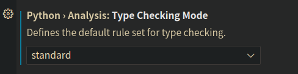
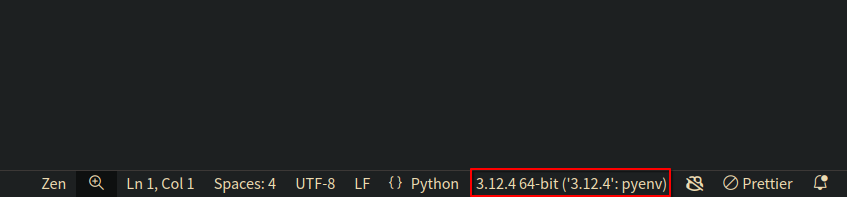

# Python Basics

## Before you start

Create a new directory in a location of your choice with a name like `python_basics`.
This directory will be your workspace for this homework.
Open the directory in your text editor (e.g., VS Code).

If you choose to use VS Code, you should go to your settings, and set "python.analysis.typeCheckingMode" to "standard". This will enable type checking in your Python code.



You should also install the Python extension for VS Code.

When your open editor is a Python file, you should see a Python version in the bottom right corner of the window, like this:



All the Python basics you need to know for this homework can be found in the [W3School](https://www.w3schools.com/python/default.asp) Python Tutorial. You should be able to complete the tasks by reading the "Arrays", "For Loops", "If...Else" and "Functions" sections.

## Problem 1: Analyzing student scores

> **Warning**: there will be a small "bug" in the provided starter code below. You will need to fix it as you implement the functions.

Copy and paste the following code into a Python file named `student_scores.py`.

```python
def average_score(scores: list[int]) -> int:
    raise NotImplementedError

def max_score(scores: list[int]) -> int:
    raise NotImplementedError

def min_score(scores: list[int]) -> int:
    raise NotImplementedError

def num_scores_above(scores: list[int], threshold: int) -> int:
    raise NotImplementedError

def median_score(scores: list[int]) -> float:
    raise NotImplementedError

def standard_deviation(scores: list[int]) -> float:
    raise NotImplementedError

if __name__ == "__main__": # This block of code will be executed when you run the file
    scores: list[int] = [90, 85, 70, 75, 80, 59, 80, 75, 90, 87, 93, 78, 80, 85, 100]

    print(f"Average score: {average_score(scores)}")
    print(f"Max score: {max_score(scores)}")
    print(f"Min score: {min_score(scores)}")
    print(f"Number of scores above 80: {num_scores_above(scores, 80)}")
    print(f"Median score: {median_score(scores)}")
    print(f"Standard deviation: {standard_deviation(scores)}")
```

In each function, replace `raise NotImplementedError` with your implementation of the function.

Notice that in each function definition, there is a type hint for the parameters and the return type. This is a good practice to follow when writing Python code. This will be the required format of all functions in your future homework assignments (and any Python code you write in general!).

Here are the type hints we used in the starter code:

-   `int` means that the return value of the function is an integer.
-   `list[int]` means that the parameter is a list of integers.
-   `float` means that the return value of the function is a floating-point number.
-   `->` is used to indicate the return type of the function.

We will cover type hints in more detail in the future.

## Problem 2: Analyzing student scores (continued)

Now that you've implemented the functions to analyze student scores, you may wonder how this code can be used in a real-world scenario. One way to use this code is to read student scores from a file and analyze them. (You don't want to store your data in a Python file like we did in Problem 1!)

A common file format for storing data is a CSV (Comma Separated Values) file. In a CSV file, each line represents a row of data, and the values in each row are separated by commas.

Create a new file named `student_scores.csv` in the same directory as `student_scores.py`. Copy and paste the following data into the file:

```csv
name,score
Alice,90
Bob,85
Charlie,70
David,75
Eve,80
Frank,59
Grace,80
Hannah,75
Isaac,90
Jane,87
Kevin,93
Lily,78
Mia,80
Noah,85
Olivia,100
```

Note that you can open a CSV file in a text editor, or in a spreadsheet program like Microsoft Excel, or Apple Numbers.

Now, modify the `student_scores.py` file to read the student scores from the `student_scores.csv` file and analyze them. To do this, you will need to use the `csv` module in Python.

Place the following code at the top of the `student_scores.py` file:

```python
import csv
```

Then, add one more function to the file (You don't have to fully understand this function yet. We will cover it in the future):

```python
def load_scores_from_csv(file_path: str) -> list[int]:
    with open(file_path, encoding="utf-8") as file:
        reader = csv.DictReader(file)
        scores = [int(row["score"]) for row in reader]
```

Finally, modify the `if __name__ == "__main__":` block to use the `load_scores_from_csv` function to read the student scores from the `student_scores.csv` file.

```python
scores: list[int] = load_scores_from_csv("student_scores.csv")
```

Your complete `student_scores.py` file should look like this:

```python
import csv

def load_scores_from_csv(file_path: str) -> list[int]:
    with open(file_path, encoding="utf-8") as file:
        reader = csv.DictReader(file)
        scores = [int(row["score"]) for row in reader]
        return scores

def average_score(scores: list[int]) -> int:
    raise NotImplementedError

def max_score(scores: list[int]) -> int:
    raise NotImplementedError

def min_score(scores: list[int]) -> int:
    raise NotImplementedError

def num_scores_above(scores: list[int], threshold: int) -> int:
    raise NotImplementedError

def median_score(scores: list[int]) -> float:
    raise NotImplementedError

def standard_deviation(scores: list[int]) -> float:
    raise NotImplementedError

if __name__ == "__main__":
    scores: list[int] = load_scores_from_csv("student_scores.csv")

    print(f"Average score: {average_score(scores)}")
    print(f"Max score: {max_score(scores)}")
    print(f"Min score: {min_score(scores)}")
    print(f"Number of scores above 80: {num_scores_above(scores, 80)}")
    print(f"Median score: {median_score(scores)}")
    print(f"Standard deviation: {standard_deviation(scores)}")
```

## Questions

1. How did you implement the `max_score` and `min_score` functions? Can you write it without a loop in only one line of code?
2. What is wrong with the starter code? Did you encounter any type errors when writing in VS Code?
